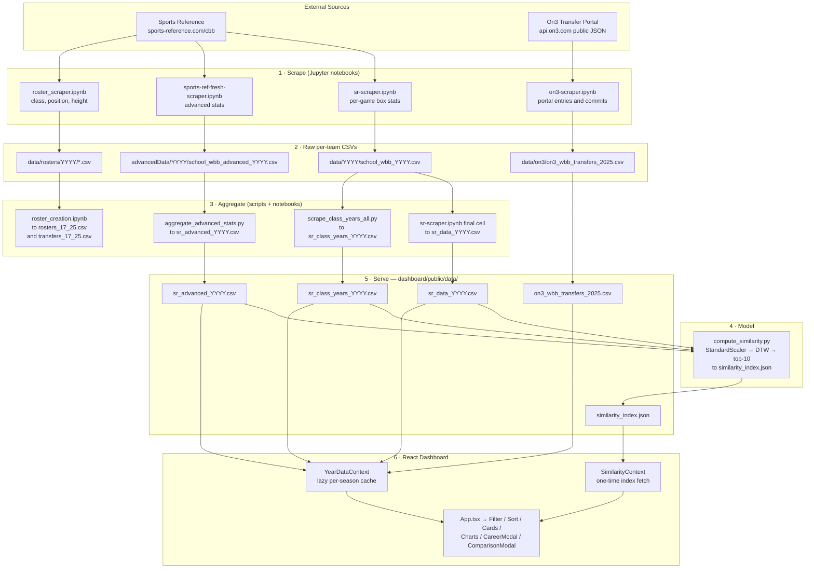

# BSA-Basketball-W26 — UCLA WBB Transfer & Freshman Evaluation Portal

**Bruin Sports Analytics · Winter 2026 Basketball Team**

An end-to-end scouting platform built for **UCLA Women's Basketball** to evaluate transfer-portal
targets and incoming freshmen. The project spans a full data pipeline — scraping ten seasons of
NCAA Division I women's basketball data from Sports Reference and transfer-portal movement from
On3 — through to an interactive React dashboard where staff can filter, sort, compare, and project
players.

**Coverage:** 2016-17 → 2025-26 seasons · ~360 D-I programs per season · ~46,000 player-seasons ·
11,515 players indexed for career-trajectory similarity.


---

## Table of Contents

1. [What the Portal Does](#what-the-portal-does)
2. [Repository Structure](#repository-structure)
3. [Data Pipeline](#data-pipeline)
4. [Data Dictionary](#data-dictionary)
5. [Dashboard Architecture](#dashboard-architecture)
6. [Career Similarity Model (DTW)](#career-similarity-model-dtw)
7. [Getting Started](#getting-started)
8. [Regenerating the Data](#regenerating-the-data)
9. [Design Docs & Specs](#design-docs--specs)
10. [Branch Map](#branch-map)
11. [Known Limitations](#known-limitations)
12. [Scope for Future Work](#scope-for-future-work)
13. [Contributors](#contributors)

---

## What the Portal Does

| Capability | Where it lives | Notes |
|---|---|---|
| **Season browser (2017–2026)** | `FilterPanel` → `YearDataContext` | Any of ten seasons loads on demand and is cached in memory. |
| **Multi-facet filtering** | `FilterPanel.tsx` | Position, class year, availability, team, conference, PPG range, minimum games, minimum MPG, transfers-only. |
| **Sorting** | `SortPanel.tsx` | Basic (PPG / RPG / APG) and advanced (TS% / OBPM / DBPM), ascending or descending. |
| **Cross-season search** | `App.tsx` (`allYearsMode`) | "All years" toggle searches every player 2017–2026 by name or school, de-duplicated to their most recent season. |
| **Player cards** | `PlayerCard.tsx` | Per-game splits, shooting splits, advanced metrics, transfer origin → destination, and a link to the player's Sports Reference page. |
| **Head-to-head comparison** | `PlayerComparisonModal.tsx` + `comparison/` | Select up to 3 players; radar chart, efficiency-vs-usage scatter, shot-profile grid, impact bars, and trend chart. |
| **Career trajectory view** | `CareerModal.tsx` | Assembles every season a player appears in across all ten year-files; three chart tabs (Scoring / Efficiency / Boards & Playmaking) plus a season-by-season table. |
| **Similar career trajectories** | `SimilarPlayersSection.tsx` | Top-10 historical comparables per player from a precomputed DTW similarity index, with PPG sparklines and 0–100 similarity scores. |
| **Dark / light theming** | `styles/theme.css` | UCLA gold + navy palette, persisted to `localStorage`. |

---

## Repository Structure

```
BSA-Basketball-W26/
│
├── README.md                              ← you are here
├── FEATURE_BRANCH_FILES.md                Onboarding note for the dashboard feature branch
├── ucla_wbb_transfer_analysis_v4.html     Standalone "Transfer Intelligence Report" (self-contained)
├── UCLA-WBB-—-Transfer-Intelligence-Report-*.png   Rendered snapshot of the report above
│
├── ── SCRAPERS (Jupyter) ──────────────────────────────────────────────────
├── sr-scraper.ipynb                       Sports Reference per-game stats, all teams × 2017–2026
├── advancedData/
│   └── sports-ref-fresh-scraper.ipynb     Sports Reference *advanced* stats (PER, TS%, BPM, WS, USG%)
├── roster_scraper.ipynb                   Team rosters (jersey #, class, position, height)
├── on3-scraper.ipynb                      On3 transfer-portal wire — Selenium probe + public JSON API
├── roster_creation.ipynb                  Aggregates rosters → derives every transfer event 2017–2025
├── get_transfer_list.ipynb                Alternate transfer detection via year-over-year school diff
│
├── ── PYTHON SCRIPTS ──────────────────────────────────────────────────────
├── scripts/
│   ├── requirements.txt                   dtaidistance, scikit-learn
│   ├── aggregate_advanced_stats.py        advancedData/YYYY/*.csv → data/yearly_data/sr_advanced_YYYY.csv
│   ├── scrape_class_years.py              Class years for 2025 only (superseded by the script below)
│   ├── scrape_class_years_all.py          Class years for every season, 2017–2026
│   └── compute_similarity.py              Pairwise DTW career similarity → similarity_index.json
│
├── ── ANALYSIS ────────────────────────────────────────────────────────────
├── exploratory_analysis/
│   └── player_compare_eda.ipynb           Year-over-year player deltas, YoY profile builder, plots
│
├── ── RAW & DERIVED DATA ──────────────────────────────────────────────────
├── data/
│   ├── 2017/ … 2026/                      Per-team per-game CSVs  (~362 files per season)
│   │   └── <school>_wbb_YYYY.csv
│   ├── rosters/2017/ … 2026/              Per-team roster CSVs
│   ├── on3/
│   │   ├── on3-wbb-transfers-2024.csv
│   │   └── on3_wbb_transfers_2025.csv
│   ├── yearly_data/                       Season-level rollups (20 files)
│   │   ├── sr_data_YYYY.csv               ← concatenated per-game stats
│   │   └── sr_advanced_YYYY.csv           ← concatenated advanced stats
│   ├── rosters_17_25.csv                  All rosters, all seasons (46,230 rows)
│   └── transfers_17_25.csv                Every detected transfer event (4,235 rows)
│
├── advancedData/
│   └── 2017/ … 2026/                      Per-team advanced-stat CSVs
│       └── <school>_wbb_advanced_YYYY.csv
│
├── ── DASHBOARD (React + TypeScript + Vite) ───────────────────────────────
├── dashboard/
│   ├── package.json                       React 18 · Vite 6 · Tailwind 4 · Recharts · lucide-react
│   ├── vite.config.ts                     React + Tailwind plugins, `@` → ./src alias
│   ├── tsconfig.json                      Strict mode, noUnusedLocals/Parameters
│   ├── index.html                         Google Fonts (Outfit + DM Sans), #root mount
│   ├── public/
│   │   ├── favicon.ico
│   │   └── data/                          ← runtime-fetched static assets (~57 MB)
│   │       ├── sr_data_YYYY.csv           (10 files)
│   │       ├── sr_advanced_YYYY.csv       (10 files)
│   │       ├── sr_class_years_YYYY.csv    (10 files)
│   │       ├── on3_wbb_transfers_2025.csv
│   │       └── similarity_index.json      (39 MB, 11,515 players × top-10 matches)
│   └── src/
│       ├── main.tsx                       createRoot → <App />
│       ├── index.css                      Tailwind entry + base element styles
│       ├── styles/theme.css               CSS custom properties: dark + light palettes
│       └── app/
│           ├── App.tsx                    Root state: year, filters, sort, selection, theme
│           ├── data/
│           │   ├── schema.ts              TransferPlayer / Position / Year types + row mapper
│           │   ├── transferData.ts        CSV parsing + per-year fetch + ON3 & advanced joins
│           │   ├── YearDataContext.tsx    Per-season fetch cache (StrictMode-safe, in-flight dedup)
│           │   ├── SimilarityContext.tsx  One-time fetch of similarity_index.json
│           │   ├── similarityTypes.ts     SimilarPlayer / SimilarityIndex types
│           │   └── conferences.ts         ~360 school-slug → conference map + ALL_CONFERENCES
│           └── components/
│               ├── Header.tsx                     Title bar, player count, theme toggle
│               ├── FilterPanel.tsx                Season selector + all filter controls
│               ├── SortPanel.tsx                  Basic / advanced sort buttons
│               ├── PlayerCard.tsx                 Memoized player tile
│               ├── StatsOverview.tsx              Four KPI tiles (avg PPG/RPG/APG/FG%)
│               ├── PointsComparisonChart.tsx      ┐
│               ├── ShootingPercentageChart.tsx    │
│               ├── StatsScatterChart.tsx          ├─ Dashboard analytics row
│               ├── PositionDistributionChart.tsx  │
│               ├── DefensiveStatsChart.tsx        ┘
│               ├── CareerModal.tsx                Career arc chart + season table
│               ├── SimilarPlayersSection.tsx      DTW comparables inside CareerModal
│               ├── PlayerComparisonModal.tsx      Shell for the 2–3 player comparison
│               └── comparison/
│                   ├── PlayerSummaryCards.tsx
│                   ├── ComparisonRadarChart.tsx
│                   ├── EfficiencyUsageScatter.tsx
│                   ├── AdvancedImpactBars.tsx
│                   ├── ShotProfileComparison.tsx
│                   └── PerformanceTrendChart.tsx
│
└── docs/
    ├── plans/
    │   ├── 2026-03-02-search-and-player-links-design.md
    │   └── 2026-03-02-search-and-player-links.md
    └── superpowers/
        ├── specs/
        │   ├── 2026-03-12-multi-year-stats-design.md
        │   └── 2026-03-15-career-similarity-design.md
        └── plans/
            ├── 2026-03-12-multi-year-stats.md
            └── 2026-03-15-career-similarity.md
```

---

## Data Pipeline



**Join keys.** Everything downstream of the scrapers is keyed on `player_sr_link` — the canonical
Sports Reference player URL. Per-game and advanced stats join on `(player_sr_link, season)`; class
years join on `(player_sr_link, year)`. The one exception is the On3 transfer feed, which carries no
SR identifier and is joined on a lowercased, trimmed player name.

---

## Data Dictionary

### `sr_data_YYYY.csv` — per-game stats (~4,400–4,800 rows/season)

`player_sr_link`, `player_name`, `school`, `season`, `pos`, `games`, `games_started`, `mp_per_g`,
`fg_per_g`, `fga_per_g`, `fg_pct`, `fg3_per_g`, `fg3a_per_g`, `fg3_pct`, `fg2_per_g`, `fg2a_per_g`,
`fg2_pct`, `efg_pct`, `ft_per_g`, `fta_per_g`, `ft_pct`, `orb_per_g`, `drb_per_g`, `trb_per_g`,
`ast_per_g`, `stl_per_g`, `blk_per_g`, `tov_per_g`, `pf_per_g`, `pts_per_g`

### `sr_advanced_YYYY.csv` — advanced stats

`player_sr_link`, `player_name`, `school`, `season`, `pos`, `games`, `games_started`, `mp`, `per`,
`ts_pct`, `fg3a_per_fga_pct`, `fta_per_fga_pct`, `pprod`, `orb_pct`, `drb_pct`, `trb_pct`,
`ast_pct`, `stl_pct`, `blk_pct`, `tov_pct`, `usg_pct`, `ows`, `dws`, `ws`, `ws_per_40`, `obpm`,
`dbpm`, `bpm`

> Percentages are stored in Sports Reference's leading-dot format (`.598`). The dashboard multiplies
> by 100 at parse time.

### `sr_class_years_YYYY.csv`

`player_sr_link`, `class` — where `class` ∈ {Freshman, Sophomore, Junior, Senior, Graduate}.
`RedShirt ` prefixes are stripped before mapping.

### `on3_wbb_transfers_2025.csv` (301 rows)

`Name`, `Position`, `Class Rank`, `Previous Team`, `Previous Team Abbrev`, `New Team`,
`New Team Abbrev`, `Status`, `Date` — `Status` ∈ {Committed, Entered, Withdrawn}. Withdrawn entries
are dropped at parse time; when a player appears more than once, the latest `Date` wins.

### `rosters_17_25.csv` (46,230 rows)

`player_sr_link`, `player_name`, `number`, `class`, `pos`, `height`, `school`, `season`

### `transfers_17_25.csv` (4,235 rows)

`player_sr_link`, `player_name`, `transfer_year`, `school_old`, `school_new` — derived by
self-joining the roster table on `player_sr_link` where `school` changes and
`season_new = season_old + 1`.

### `similarity_index.json` (39 MB)

```jsonc
{
  "https://www.sports-reference.com/cbb/players/<slug>.html": [
    {
      "player_link": "...", "player_name": "...", "school": "ucla", "position": "G",
      "year_start": 2021, "year_end": 2024,
      "seasons": [{ "class": "FR", "year": 2021, "ppg": 8.4, "rpg": 3.1, "apg": 2.0 }],
      "score": 87.3
    }
    // ... top 10 matches
  ]
}
```

---

## Dashboard Architecture

**Stack:** React 18 · TypeScript 5.6 (strict) · Vite 6 · Tailwind CSS 4 · Recharts 2 · lucide-react.
There is **no backend** — the app is a static SPA that fetches CSV/JSON from `public/data/`.

**Two React contexts carry all remote state:**

- **`YearDataProvider`** — `loadYear(year)` fetches that season's CSVs in parallel, parses and joins
  them, and stores the result in a `Map<number, TransferPlayer[]>`. It guards against React
  StrictMode double-invocation with an `inFlight` ref and keeps a `cacheRef` mirror so `loadYear`
  stays referentially stable. Switching back to a previously-viewed season is instant.
- **`SimilarityProvider`** — fetches `similarity_index.json` once at app startup and exposes it via
  `useSimilarity()`.

**Parse & join, per season** (`transferData.ts` → `fetchYearData`):

1. Fetch `sr_data_{year}.csv` and `sr_advanced_{year}.csv` (plus `sr_class_years_{year}.csv`, and
   `on3_wbb_transfers_2025.csv` for 2025) in parallel.
2. Map each per-game row into a `TransferPlayer` via `goldToTransferPlayer`, normalising position
   (`G-F`/`F-G`/`F` → `F`; `F-C`/`C-F`/`C` → `C`; everything else → `G`).
3. Attach `ts_pct`, `obpm`, `dbpm` from the advanced map, keyed on `player_sr_link`.
4. Resolve conference from the school slug via `conferences.ts`.
5. For 2025 only, attach `transferInfo` from the On3 map and set `availability` to `Committed` or
   `Available`. `stripMascot()` trims mascot names ("Connecticut Huskies" → "Connecticut"), with a
   hard-coded list for two-word mascots.

**Performance guards already in place:**

- 200 ms debounce on the search input.
- `ChartSection` is `memo`ised and caps chart input to the top 30 players by PPG.
- Player list defaults to 10 visible cards with a user-adjustable limit.
- `PlayerCard` is `memo`ised; `selectedIds` is a `Set` to keep selection lookups O(1).

---

## Career Similarity Model (DTW)

`scripts/compute_similarity.py` answers *"which historical players had a career arc like this one?"*

1. **Assemble sequences.** For each player, gather every season with **≥ 8 games played**. Players
   with fewer than 2 qualifying seasons are dropped. Seasons are ordered by class year
   (`FR → SO → JR → SR → GR`), falling back to calendar year when class is unknown.
2. **Feature vector (10 dims per season):** `pts_per_g`, `trb_per_g`, `ast_per_g`, `stl_per_g`,
   `blk_per_g`, `fg_pct`, `fg3_pct`, `ft_pct`, `ts_pct`, `mp_per_g`.
3. **Standardise.** A single `StandardScaler` is fit across all player-seasons, then applied per
   sequence, so no single stat dominates the distance.
4. **Distance.** Multidimensional Dynamic Time Warping with per-step L2 cost —
   `cost[i,j] = ‖s₁[i] − s₂[j]‖₂ + min(cost[i−1,j], cost[i,j−1], cost[i−1,j−1])`. This matches
   `dtaidistance.dtw_ndim.distance_fast` semantics; the script implements it in pure NumPy because
   the C extension was not compiled on the authoring machine. DTW (rather than a fixed-length vector
   distance) means a 3-season career can still be matched against a 4-season one.
5. **Position grouping.** Comparisons are restricted to the same normalised position (G / F / C),
   using the player's most recent listed position.
6. **Scoring.** `score = 100 · exp(−d / scale)`, where `scale` is the median pairwise DTW distance
   within the position group (sampled at 2,000 players when a group exceeds 3,200, seeded at 42 for
   reproducibility). The top 10 matches per player are kept via a heap, computed across 8 worker
   processes.

**Output:** 11,515 indexed players. The UI badges scores ≥ 80 green, ≥ 60 amber, below that grey.

---

## Getting Started

### Dashboard

```bash
cd dashboard
npm install
npm run dev          # http://localhost:5173
```

```bash
npm run build        # tsc -b && vite build → dist/
npm run preview      # serve the production build locally
```

All data is committed under `dashboard/public/data/`, so no scraping is required to run the app.

> **Heads-up on first load:** `similarity_index.json` is 39 MB and is fetched eagerly on app
> startup. On a slow connection the "Similar Career Trajectories" section will spin for a while;
> everything else in the dashboard remains usable meanwhile.

### Python tooling

```bash
python3 -m venv .venv && source .venv/bin/activate
pip install -r scripts/requirements.txt             # dtaidistance, scikit-learn
pip install numpy pandas requests beautifulsoup4    # also required by the scripts
```

### Notebooks

The scrapers additionally need `scrapy`, `selenium` (with geckodriver for Firefox), `polars`, and
`tqdm`. Run every notebook **from the repository root** — paths inside are relative to it.

---

## Regenerating the Data

Run in this order. Scraping all ten seasons takes many hours; Sports Reference rate-limits
aggressively and the scrapers back off for 60 s on HTTP 429.

```bash
# 1. Per-game box stats  →  data/YYYY/<school>_wbb_YYYY.csv, then data/yearly_data/sr_data_YYYY.csv
jupyter nbconvert --execute sr-scraper.ipynb

# 2. Advanced stats      →  advancedData/YYYY/<school>_wbb_advanced_YYYY.csv
jupyter nbconvert --execute advancedData/sports-ref-fresh-scraper.ipynb
python3 scripts/aggregate_advanced_stats.py        # → data/yearly_data/sr_advanced_YYYY.csv

# 3. Rosters + transfer events
jupyter nbconvert --execute roster_scraper.ipynb
jupyter nbconvert --execute roster_creation.ipynb  # → data/rosters_17_25.csv, data/transfers_17_25.csv

# 4. On3 transfer portal  →  data/on3/on3_wbb_transfers_2025.csv
jupyter nbconvert --execute on3-scraper.ipynb

# 5. Publish CSVs to the dashboard
cp data/yearly_data/sr_data_*.csv data/yearly_data/sr_advanced_*.csv dashboard/public/data/
cp data/on3/on3_wbb_transfers_2025.csv dashboard/public/data/

# 6. Class years (reads sr_data_YYYY.csv from dashboard/public/data/, writes alongside it)
python3 scripts/scrape_class_years_all.py          # all years
python3 scripts/scrape_class_years_all.py 2026     # or a single year

# 7. Similarity index (hours of compute; 8 processes)
python3 scripts/compute_similarity.py              # → dashboard/public/data/similarity_index.json
```

`scrape_class_years_all.py` skips any year whose output file already exists — delete the file to
force a re-scrape. `scripts/scrape_class_years.py` is the earlier 2025-only version and still points
at the retired `dashboard/src/app/data/` location; prefer the `_all` variant.

---

## Design Docs & Specs

The two largest features were specced before implementation. Read these before extending them:

| Document | Covers |
|---|---|
| [`2026-03-12-multi-year-stats-design.md`](docs/superpowers/specs/2026-03-12-multi-year-stats-design.md) | Season selector, dynamic-fetch architecture, career view, conference gaps |
| [`2026-03-12-multi-year-stats.md`](docs/superpowers/plans/2026-03-12-multi-year-stats.md) | Task-by-task implementation plan for the above |
| [`2026-03-15-career-similarity-design.md`](docs/superpowers/specs/2026-03-15-career-similarity-design.md) | DTW algorithm, feature/column mapping, class-year handling, scoring |
| [`2026-03-15-career-similarity.md`](docs/superpowers/plans/2026-03-15-career-similarity.md) | File map and build order for the similarity feature |
| [`2026-03-02-search-and-player-links-design.md`](docs/plans/2026-03-02-search-and-player-links-design.md) | Original search + SR-profile-link design (build-time `?raw` imports, since superseded by runtime fetch) |

---

## Branch Map

`main` is the integration branch. Feature branches document how the project was assembled:

| Branch | Contribution |
|---|---|
| `wbb-dashboard-super-tables` | The dashboard itself — filters, multi-year support, career modal, similarity, redesign |
| `comparison-tool` | Player comparison modal and its six comparison charts |
| `sr-scraper` | Initial Sports Reference scraping and the 2024 transfer list |
| `on3-transfer-scraper` | On3 portal scraper and data layout |
| `raja_eda` | Roster scraping, roster aggregation, transfer-event derivation 2017–2025 |
| `player-compare-eda` | Year-over-year player comparison EDA |
| `freshman_impact_scraper` | Top-100 recruit analysis (freshman evaluation track) |
| `ncaa-stats-scrape` | Schematic for an NCAA-sourced stats scraper |
| `lucas-transfer-analysis` | Standalone transfer analysis contributions |

---

## Known Limitations

These are real constraints in the current build, not speculative concerns — read them before trusting
a number on screen.

- **Several comparison-modal metrics are synthetic.** `PerformanceTrendChart` generates 15 games of
  `Math.random()` jitter around a player's season average — it is a shape placeholder, not game logs.
  `ShotProfileComparison` uses hard-coded zone frequencies (35/25/15/15/10) and derives zone
  efficiency by adding fixed offsets to FG%/3P%. Neither reflects actual shot-location data.
- **TS% and usage are approximated twice, inconsistently.** `PlayerSummaryCards` and
  `EfficiencyUsageScatter` estimate true shooting and usage from PPG/FG%/MPG, even though real
  `ts_pct` and `usg_pct` already sit in `sr_advanced_YYYY.csv` (and real TS% is already surfaced on
  the player card).
- **Transfer-portal context exists for 2025 only.** The transfers-only filter is disabled on every
  other season; `data/on3/on3-wbb-transfers-2024.csv` was scraped but never wired in.
- **The On3 join is name-based.** Nickname, punctuation, or accent differences will silently miss.
- **Conference assignment is anachronistic.** `conferences.ts` encodes the 2024-25 landscape and is
  applied to all ten seasons, so 2018 Pac-12 schools display under their current conference. Schools
  that no longer exist resolve to `Unknown`.
- **The CSV parser splits on commas.** A quoted field containing a comma would corrupt the row.
- **`availability` is effectively binary.** `Considering` is offered as a filter but never assigned
  by the data layer.
- **`height` is dropped.** Every player renders `—` even though `rosters_17_25.csv` carries height.
- **Data is duplicated.** `data/yearly_data/` and `dashboard/public/data/` hold the same 20 CSVs, and
  the repository carries ~125 MB of committed data.
- **No tests, no CI, no deployment configuration.**

---

## Scope for Future Work

Ordered roughly by value-to-effort for the next cohort.

1. **Replace the synthetic charts with real data.** Swap `PerformanceTrendChart`'s random jitter for
   actual game logs (Sports Reference publishes per-game logs on each player page) and either source
   real shot-location data or retire `ShotProfileComparison`. Until then, label both components as
   illustrative in the UI so no one scouts off a random number generator.
2. **Use the advanced stats already on disk.** Wire `ts_pct`, `usg_pct`, `per`, `ws_per_40`, and
   `bpm` from `sr_advanced_YYYY.csv` directly into `PlayerSummaryCards`, `EfficiencyUsageScatter`,
   and `AdvancedImpactBars` instead of recomputing approximations from per-game splits.
3. **Shrink and shard the similarity index.** 39 MB fetched on startup is the single largest
   performance cost in the app. Split the index into per-player (or per-position) JSON shards fetched
   lazily when the Career Modal opens, or serve it from a small API. Trimming stored fields and
   gzipping would cut it further.
4. **Extend transfer-portal coverage to every season.** Backfill the On3 wire for 2017–2024 (the 2024
   file already exists), and switch the join from lowercased names to a fuzzy or manually curated
   name → `player_sr_link` crosswalk so the transfers-only filter works on any season.
5. **Build a genuine freshman-evaluation track.** The portal is currently transfer-first. Merge the
   `freshman_impact_scraper` branch's top-100 recruit work into `main`, join recruiting-service
   rankings (On3 / 247 / ESPN) to first-season Sports Reference production, and model *"what does a
   consensus top-50 recruit actually produce as a freshman?"* — then surface projected freshman output
   alongside transfer comparables.
6. **Add a UCLA fit layer.** Today the dashboard evaluates players in the abstract. Add UCLA's
   current roster as a first-class entity: positional need by season, minutes available, projected
   depth chart after departures, and a "fit score" weighting a target's profile against those gaps.
   This is what turns a scouting table into an evaluation *portal*.
7. **Adjust for strength of schedule and conference.** A 20-PPG scorer in the SWAC and one in the SEC
   are not comparable. Compute opponent-adjusted ratings (or at minimum a conference-strength
   multiplier) and expose an "adjusted" toggle across the stat displays and the DTW feature vector.
8. **Make conference assignment historical.** Replace the single 2024-25 map with a
   `(school, season) → conference` table so historical seasons render correctly, and fill in the
   defunct programs that currently resolve to `Unknown`.
9. **Add a projection model, not just similarity.** DTW finds analogues; the natural next step is
   using those analogues to forecast next-season production with an uncertainty band — the EDA in
   `exploratory_analysis/player_compare_eda.ipynb` already builds the year-over-year delta table such
   a model would train on.
10. **Harden the data layer.** Replace the naive comma-split parser with a real CSV parser (PapaParse
    or equivalent), add schema validation at parse time, and surface a per-season data-quality panel
    (join match rates, missing advanced stats, unresolved conferences) so silent gaps become visible.
11. **Automate the pipeline.** Promote the notebook scrapers into idempotent, resumable Python
    modules with checkpointing and a shared rate limiter, then schedule them so the dashboard
    refreshes during the portal window without a manual multi-hour run.
12. **Deploy it.** The app is a static build — publish to GitHub Pages, Netlify, or Vercel behind
    access control so coaching staff can use it without a local dev server, and add a CI job running
    `tsc -b && vite build` on every PR.
13. **Speed up similarity computation.** `dtw_distance` is a pure-Python double loop; compiling
    `dtaidistance`, or vectorising with Numba/Cython, would take the all-pairs job from hours to
    minutes and make it feasible to re-run whenever new data lands.
14. **Add saved boards and export.** Let staff pin a watchlist, annotate players, and export a
    filtered set to CSV or a shareable report — the standalone `ucla_wbb_transfer_analysis_v4.html`
    shows the report format staff responded to; generate it from live dashboard state instead of by
    hand.
15. **Virtualise the player list.** The display limit currently defaults to 10 cards. With
    `react-window` (or equivalent) the full ~4,700-player result set could scroll smoothly, and the
    30-player chart cap could be lifted to a user-chosen sample.
16. **Recover dropped roster attributes.** Join `rosters_17_25.csv` into the season data to populate
    height, jersey number, and a second source of truth for class year and position — height alone
    matters materially for positional evaluation.
17. **Deduplicate committed data.** Keep one canonical copy of each CSV (or move the ~125 MB of data
    to Git LFS / external storage) and make the dashboard's `public/data/` a build-step copy rather
    than a second checked-in tree.
18. **Add a test suite.** Unit tests for the parsing and join logic in `transferData.ts` and
    `schema.ts` (position normalisation, mascot stripping, percentage scaling, ON3 status handling),
    plus a smoke test that every season's CSVs load and join above a minimum match rate.
19. **Improve accessibility and responsiveness.** Add keyboard navigation and focus management to the
    modals, ARIA labels on the filter controls, and verify the multi-column grid degrades usably on a
    tablet — staff will open this on the sideline, not only on a laptop.
20. **Track and version the data.** Stamp each generated CSV with a scrape date and source URL, and
    show "data as of …" in the dashboard footer so a stale season is obvious at a glance.

---

## Contributors

Bruin Sports Analytics, Winter 2026 Basketball Team — Sampath Kalagarla, Alice Gottlieb,
Raja Kavasseri, Harsh Govindji, Josh Rusit, Lucas Pichardo, Daniel Lenney, and Moulik Chatterjee.

---

## Data Sources & Attribution

- **[Sports Reference — College Basketball](https://www.sports-reference.com/cbb/)** — per-game
  stats, advanced stats, and rosters. The scrapers use a 4-second delay between requests and honour
  HTTP 429 back-off. Please keep any new scraping equally polite.
- **[On3](https://www.on3.com/transfer-portal/wire/womens-basketball/)** — transfer-portal wire, via
  their public JSON API.

Data is used for internal research and evaluation by Bruin Sports Analytics.
